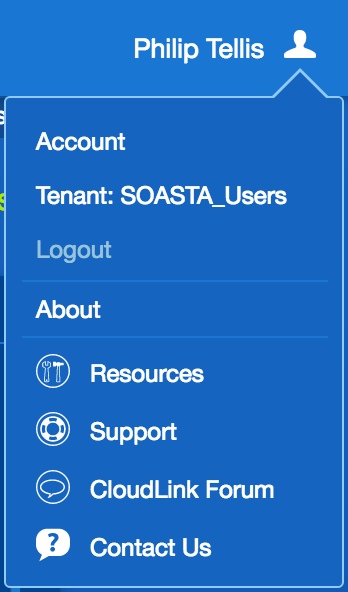
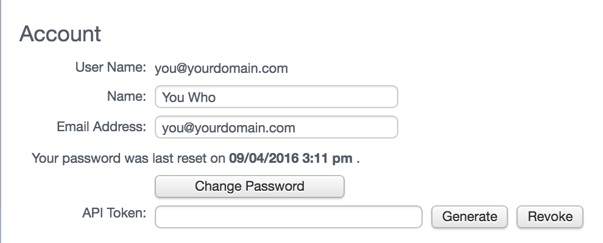

# How to generate an mPulse API Token

An mPulse API Token is a token unique to your mPulse account that allows you to authenticate with
the mPulse Query and Repository APIs without sending your username and password over the network.

A token may be revoked or regenerated at any time, but you may only have one token at any given
time.

The token is used to authenticate as you, so any script using your token has all of your privileges.

## Step 1. Sign in to mPulse

Sign in to mPulse by visiting [https://mpulse.soasta.com/](https://mpulse.soasta.com/) and entering
your username and password:

## Step 2. Visit your Account Settings

After signing in, click on your name in the top right corner to show the User Menu, and select
Account from there:

## Step 3. Generate a new API Token

In your account settings page, the first section contains your personal information, and has options
to Change your password and Generate/Revoke your API Token.

If you don't already have an API Token generated, click the **Generate** link:

## Step 4. Copy the API Token

You should now have an API Token in the text field labelled **API Token**.  Copy this out and use it
for the [`mPulseAPI.getRepositoryToken`](@ref) call.

